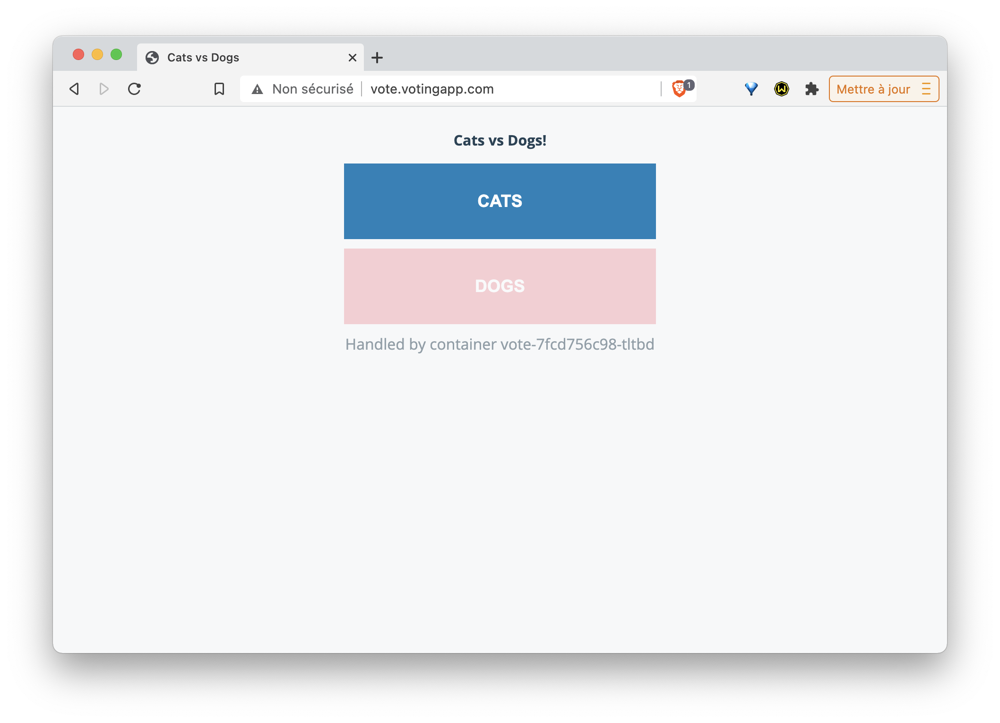
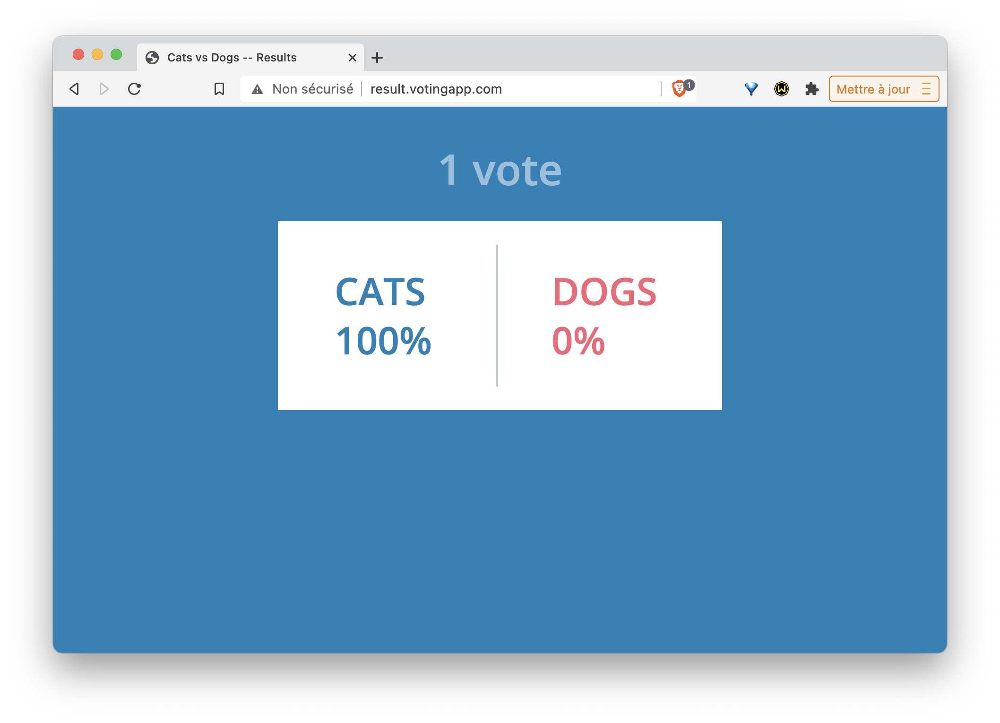

Dans cet exercice, vous allez créer une ressource *Ingress* et l'utiliser pour router les requêtes vers les interfaces de vote et de result de la VotingApp.

## Pré-requis

Assurez-vous d'avoir installé le nginx Ingress Controller comme détaillé dans [l'exercice précédent]

## Lancement de la VotingApp

Déployez la version 2 de la Voting App avec la commande suivante, celle-ci fait référence à une URL pointant vers un fichier définissant l'ensemble des ressources:

```
kubectl apply -f https://luc.run/vote.yaml
```

## Ports des Service vote et result

La commande suivante liste les services existants:

```
$ kubectl get svc
NAME         TYPE        CLUSTER-IP       EXTERNAL-IP   PORT(S)        AGE
db           ClusterIP   10.109.49.85     <none>        5432/TCP       2m31s
kubernetes   ClusterIP   10.96.0.1        <none>        443/TCP        24h
redis        ClusterIP   10.103.148.203   <none>        6379/TCP       2m31s
result       ClusterIP   10.108.23.230    <none>        5000/TCP       2m31s
result-ui    NodePort    10.101.9.144     <none>        80:31001/TCP   2m31s
vote         ClusterIP   10.98.37.242     <none>        5000/TCP       2m31s
vote-ui      NodePort    10.102.198.30    <none>        80:31000/TCP   2m31s
```

Nous pouvons voir que:
- le Service *vote-ui* expose le port *80* à l'intérieur du cluster, et le port *31000* à l'extérieur.
- le Service *resul-uit* expose le port *80* à l'intérieur du cluster, et le port *31001* à l'extérieur.

## Création de la ressource Ingress

Créez un fichier *vote_ingress.yaml* contenant la spécification suivante:

```
apiVersion: networking.k8s.io/v1
kind: Ingress
metadata:
  name: voting-domain
spec:
  ingressClassName: nginx
  rules:
  - host: vote.votingapp.com
    http:
      paths:
      - path: /
        pathType: Prefix
        backend:
          service:
            name: vote-ui
            port:
              number: 80
  - host: result.votingapp.com
    http:
      paths:
      - path: /
        pathType: Prefix
        backend:
          service:
            name: result-ui
            port:
              number: 80
```

La spécification si dessus définit une ressource Ingress contenant 2 *rules*:
- la première spécifie que les requêtes qui arrivent sur *http://vote.votingapp.com* sont forwardées sur le port *80* du Service nommé *vote-ui*
- la seconde spécifie que les requêtes qui arrivent sur *http://result.votingapp.com* sont forwardées sur le port *80* du Service nommé *result-ui*

Créez cette ressource à l'aide de la commande suivante:

```
kubectl apply -f vote_ingress.yaml
```

## Accès à l'application

Dans le fichier */etc/hosts* (si vous êtes sur Windows il s'agit du fichier *C:\Windows\System32\drivers\etc\hosts* qu'il faudra ouvrir avec les droits administrateur), définissez les résolutions DNS des sous-domaines *vote.votingapp.com* et *result.votingapp.com*. Ceux-ci devront pointer vers:

- l'adresse IP d'une des machines de votre cluster si le Ingress Controller est exposé via un Service de type NodePort
- l'adresse IP du LoadBalancer si le Ingress Controller est exposé via un Service de type LoadBalancer

Vous pouvez maintenant voter depuis l'interface de vote et visualiser les résultats sur l'interface de results.

- L'interface de vote est disponible:
  * sur http://vote.votingapp.com (port 80) si le Ingress Controller est exposé avec un service de type LoadBalancer
  * sur http://vote.votingapp.com:NODE-PORT, si le Ingress Controller est exposé avec un service de type *NodePort* (remplacez alors *NODE-PORT* par le port du service en question)



- L'interface de result est disponible:
  * sur http://result.votingapp.com (port 80) si le Ingress Controller est exposé avec un service de type LoadBalancer
  * sur http://result.votingapp.com:NODE-PORT si le Ingress Controller est exposé avec un service de type *NodePort* (remplacez alors *NODE-PORT* par le port du service en question)



## Cleanup

- Supprimez la Voting App à l'aide de la commande suivante:

```
kubectl delete -f https://luc.run/vote.yaml
```

- Supprimez le Ingress Controller en supprimant le namespace *ingress-nginx* et les ressources qui ont été créées en même temps:

```
kubectl delete ns ingress-nginx
kubectl delete clusterrole ingress-nginx
kubectl delete clusterrolebinding ingress-nginx
kubectl delete -A ValidatingWebhookConfiguration ingress-nginx-admission
```

- Supprimez également la ressource Ingress

```
kubectl delete -f vote_ingress.yaml
```

### En résumé

Une ressource Ingress permet de diriger les flux HTTP vers différents services de l'application en fonction du nom de domaine utilisé. Il est aussi possible d'établir des règles beaucoup plus fines en se basant sur l'URL de la requête. On peut également se servir d'une ressource Ingress pour mettre en place une terminaison TLS.
