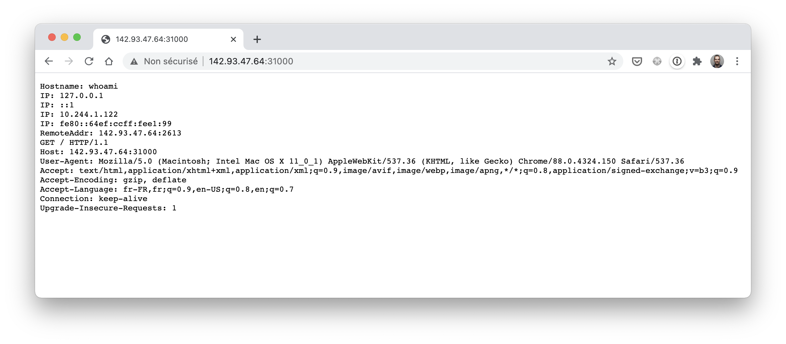

## Exercice 2

Dans cet exercice, vous allez créer un Pod et l'exposer à l'extérieur du cluster en utilisant un Service de type *NodePort*.

### 1. Création d'un Pod

Créez un fichier *whoami.yaml* définissant un Pod ayant les propriétés suivantes:
- nom: *whoami*
- label associé au Pod: *app: whoami* (ce label est à spécifier dans les metadatas du Pod)
- nom du container: *whoami*
- image du container: *containous/whoami*

Créez ensuite le Pod spécifié dans *whoami.yaml*.

### 2. Définition d'un service de type NodePort

Créez un fichier *whoami-np.yaml* définissant un service ayant les caractéristiques suivantes:
- nom: *whoami-np*
- type: *NodePort*
- un selector permettant le groupement des Pods ayant le label *app: whoami*.
- forward des requêtes vers le port *80* des Pods sous-jacents
- exposition du port *80* à l'intérieur du cluster
- exposition du port *31000* sur chacun des nodes du cluster (pour un accès depuis l'extérieur)

Créez ensuite le Service spécifié dans *whoami-np.yaml*

### 3. Accès au Service depuis l'extérieur

Lancez un navigateur sur le port 31000 de l'une des machines du cluster.

Note: vous pouvez obtenir les adresses IP externes des nodes de votre cluster dans la colonne *EXTERNAL-IP* du résultat de la commande suivante:

```
kubectl get nodes -o wide
```



### 4. Cleanup

Supprimez l'ensemble des ressources créés dans cet exercice