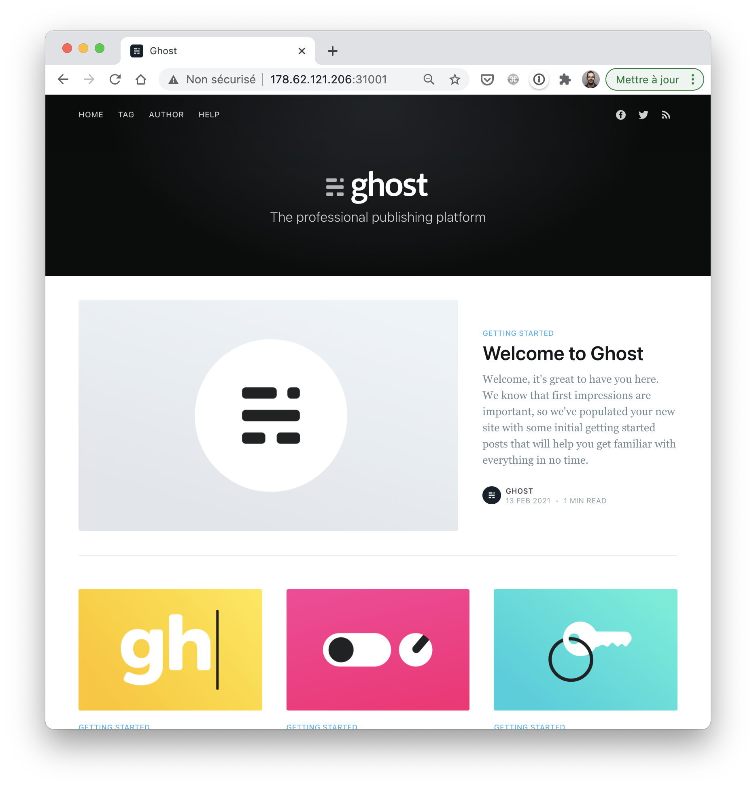

## Exercice 5

Dans cet exercice, vous allez créer un Deployment et l'exposer à l'extérieur du cluster via un service de type NodePort.

### 1. Création d'un Deployment

Créez un fichier *ghost_deployment.yaml* définissant un Deployment ayant les propriétés suivantes:
- nom: *ghost*
- nombre de replicas: 3
- définition d'un selector sur le label *app: ghost*
- spécification du Pod:
  * label *app: ghost*
  * un container nommé *ghost* basé sur l'image *ghost:4* et exposant le port *2368*

Créez ensuite la ressource spécifiée.

### 2. Status du Deployment

A l'aide de *kubectl*, examinez le status du Deployment *ghost*.

A partir de ces informations, que pouvez-vous dire par rapport au nombre de Pods gérés par ce Deployment ?

### 3. Status des Pods associés

A l'aide de *kubectl*, lister les Pods associés à ce Deployment.

### 4. Exposition des Pods du Deployment

Créez un Service permettant d'exposer les Pods du Deployment à l'extérieur du cluster

Conseils:

- vous pourrez commencer par créer une spécification pour le Service, en spécifiant que le *selector* doit permettre de regrouper les Pods ayant le label *app: ghost*.

- utilisez un service de type *NodePort*, vous pourrez par exemple le publier sur le port *31001* des nodes du cluster

- le container basé sur l'image *ghost:4* tourne sur le port *2368*, ce port devra donc être référencé en tant que *targetPort* dans la spécification du Service.

Note: n'hésitez pas à vous reporter à l'exercice sur les Services de type NodePort que nous avons vu précédemment

Une fois le service créé, vous pourrez accéder à l'interface de l'application *ghost* sur *http://IP:31001* ou IP est l'adresse IP d'une machine du cluster Kubernetes.

Note: vous pouvez récupérer les IPs des machines de votre cluster avec la commande `$ kubectl get nodes -o wide`



### 5. Cleanup

Supprimez le Deployment ainsi que le Service créés précédemment.


## Correction

```yaml
apiVersion: apps/v1
kind: Deployment
metadata:
  name: ghost
spec:
  replicas: 3
  selector:
    matchLabels:
      app: ghost
  template:
    metadata:
      labels:
        app: ghost
    spec:
      containers:
      - name: ghost
        image: ghost:4
        ports:
        - containerPort: 2368

---

apiVersion: v1
kind: Service
metadata:
  name: ghost
spec:
  selector:
    app: ghost
  type: NodePort
  ports:
  - port: 80
    targetPort: 2368
    nodePort: 31001
```